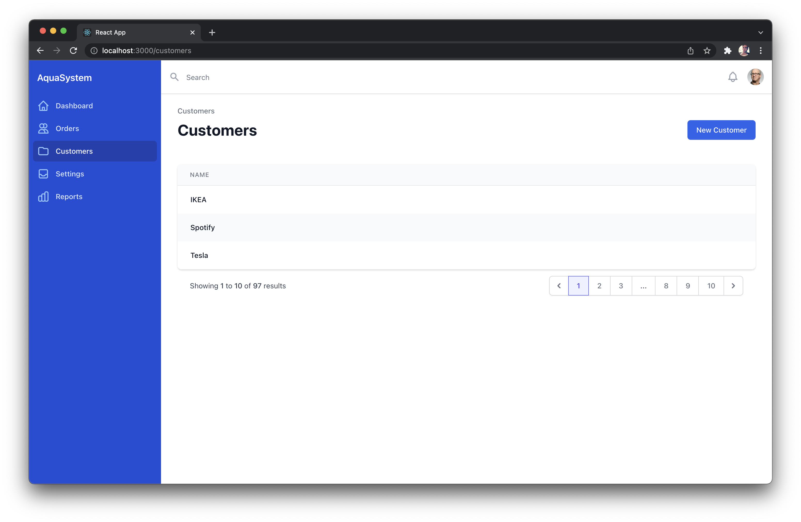

# CRM Example App with Nhost [WIP]



### Using the following technologies:

- [Nhost](https://nhost.io) (obviously)
- [React](https://reactjs.org/)
- [React Router v6](https://reactrouter.com/docs/en/v6)
- [TypeScript](https://www.typescriptlang.org/)
- [GraphQL Codegen](https://www.graphql-code-generator.com/)
- [Tailwind CSS](https://tailwindcss.com/)
- [Tailwind UI](https://tailwindui.com/)

### Some features showcased in this example

- Postgres
- GraphQL
- Permissions
- Authentication
  - Sign Up
  - Sign In
  - Reset Password
- Storage
  - Upload
  - Download (with presigned URLs)
- Serverless functions

---

## Todo

This example app has some work in progress:

### Customers: New

- [ ] Add zipcode, town and country to new users
- [ ] Toast for submits

### Customers: Customer

- [ ] Render single customer

### Customers: List

- [ ] Show correct current and total results
- [ ] Correct pagination

## Orders: List

- [ ] List existing orders

## Orders: New

- [ ] Create new order

## Orders: Order

- [ ] Render single order

## Settings

- [ ] Update company name and address
- [ ] Add company logo
- [ ] ~ Client-side cropping to company logo before uploading

## Search:

- [ ] Make top-level search bar working

---

## Get started

1. Install dependencies

```
npm install
```

2. Terminal 1: Start Nhost

```
nhost dev
```

2. Terminal 2: Start React App

```
npm run start
```

3. Terminal 3: Start GraphQL Codegens

> Make sure that the Nhost backend in step 2 has started and is available before you run this command

```
npm run codegen -- -w
```
