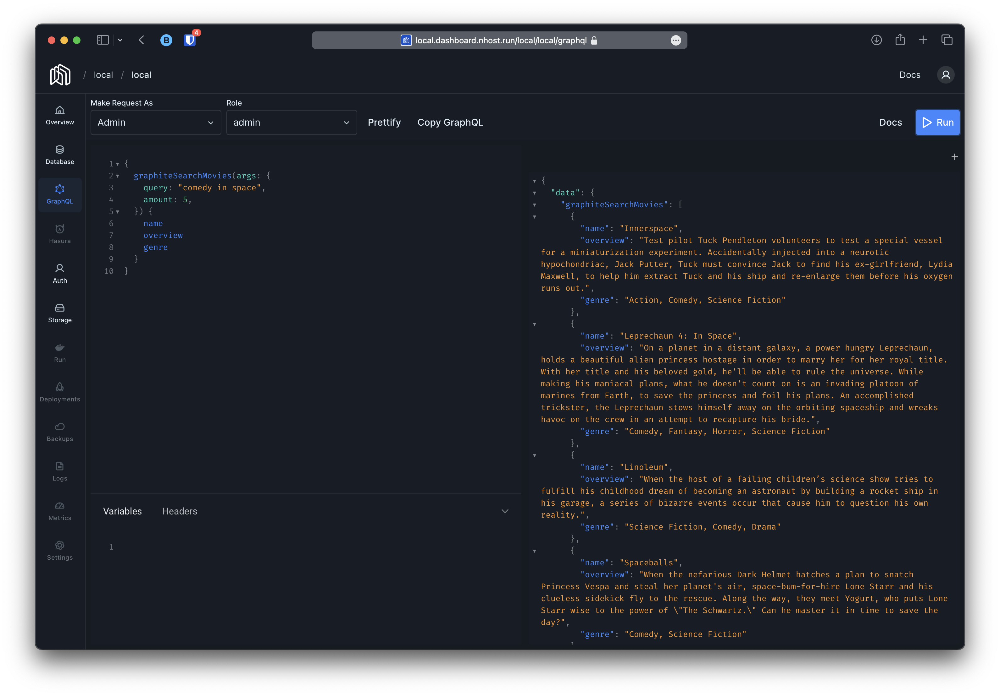
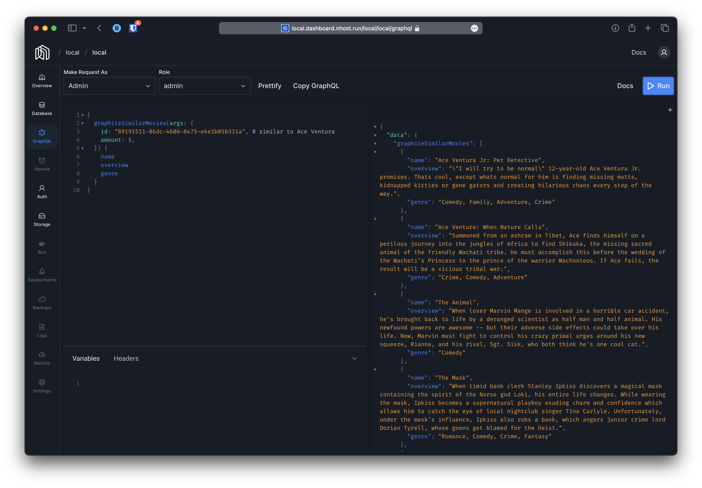
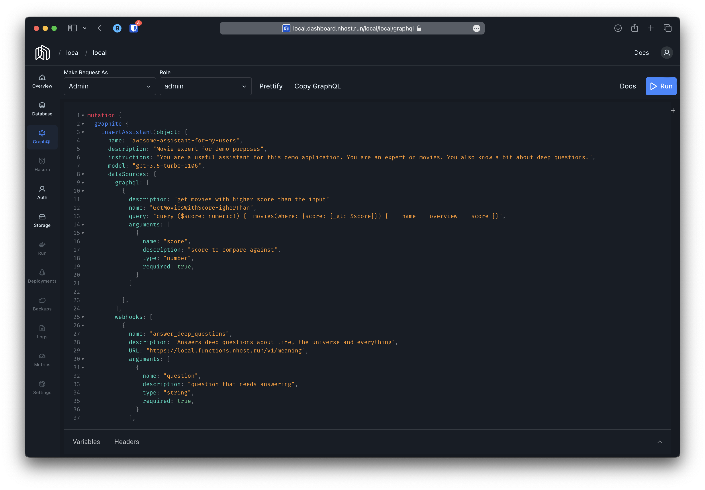
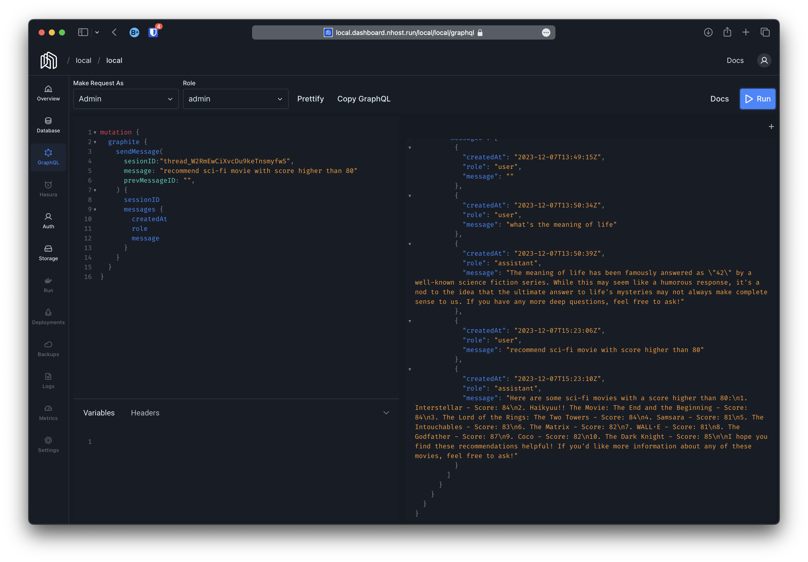

# graphite

Graphite extends the [Nhost stack](https://nhost.io) providing AI super-powers to your application.

## Features

* Auto-Embeddings
  * Generate embeddings for your data automatically as it is inserted or modified
  * Provide a GraphQL query for similarity searches to compare objects in your database
  * Provide a GraphQL query to search objects using natural language
  * Embeddings sources supported:
    * [OpenAI](https://platform.openai.com/docs/guides/embeddings)
* AI Assistants
  * Create AI assistants so your users can interact with your data using AI.
  * Different AI assistants can have different views of your data
  * Extend with custom data via webhooks
  * Automate workflows by exposing GraphQL queries or mutations or custom webhooks to the AI assistant
  * GraphQL API to interact with the assistants.
  * Permissions fully integrated with hasura and hasura-auth; control who and who can not use which assistant via permissions.
  * Access to the underlying data for the assistant is limited to what the user can see.
* Developer Assistant
  * Custom AI assistant with access to your project's information
  * Allow the developers in your team to leverage AI to develop faster and better

### Auto-Embeddings

Embeddings are automatically generated based on defined rules and a new GraphQL query to search objects using natural language is automatically added to the schema:

Similarly, a GraphQL schema to search for similar objects is also provided:

Both queries respect the user session and permissions so only results the user is allowed to see are returned.

In addition, thanks to [pgvector](https://github.com/pgvector/pgvector) you can easily perform any operations on the generated embeddings directly from your application.

### AI Assistants

#### Assistant File Stores

When an assistant is created, a file store can be optionally selected. Use a file store to provide the assistant with access to files managed by [Nhost Storage](https://docs.nhost.io/product/storage).

Note: OpenAI's Assistants API only supports one vector/file store per assistant. We have decided to implement a many-to-many relationship between file stores and assistants because we believe that OpenAI's limitation is temporary and having a many-to-many relationship allows us to easily support multiple file stores per assistant in the future.

### File Store

A file store is a set of files from one ore more storage buckets that the assistant can use to extend its capabilities.

Graphite makes sure that files from the selected storage buckets have their embeddings automatically generated and kept in sync using OpenAI's Files and Vector Store APIs.

#### File Store Buckets

A file store can be configured to sync with one or more storage buckets. The sync is done automatically whenever a file store is created or deleted as follows:

* When a file store is created, the files from the selected buckets are uploaded to OpenAI and embeddings are generated, if they haven't been already.
* When a file store is deleted, the files from the selected buckets are removed from OpenAI, if those buckets are not selected in another file store.

The webhook responsible for syncing of the file store with the selected buckets is in `graph/w_file_store_buckets_webhook.go`. The webhook is triggered when inserting/deleting rows in the `file_store_buckets` table (many-to-many).

## Getting started

The easiest way to run graphite is using [Nhost](link-to-nhost-guide). If you want to self-host you can use the following [docker-compose](build/dev/docker/docker-compose.yaml) file as reference. If you are using self-hosting and want to use your own postgres image or service you will need the following postgres extensions:

* [pgvecor](https://github.com/pgvector/pgvector)
* [http](https://github.com/pramsey/pgsql-http)

## Contributing

Refer to the monorepo [contribution guide](../../CONTRIBUTING.md) and the service [development guide](DEVELOPMENT.md) for guidelines on contributing to the AI service.
