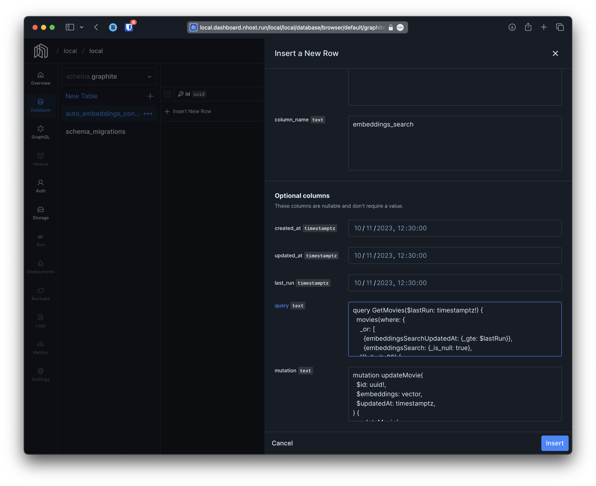
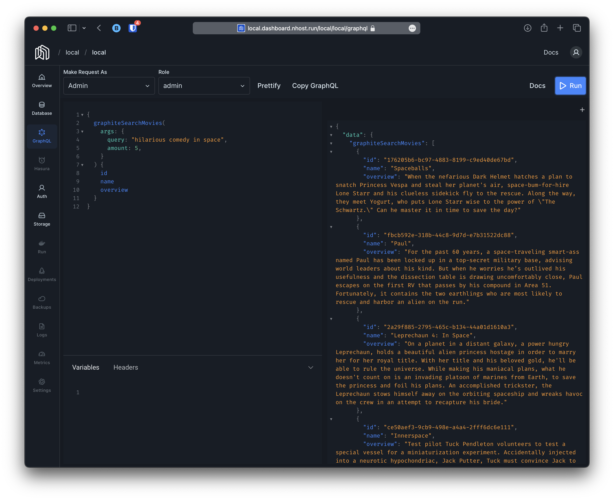
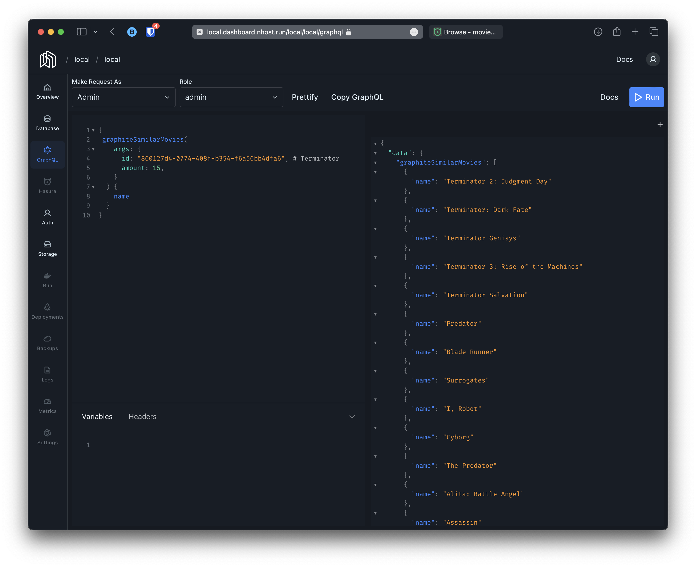

# Demo: Movies

In this demo we are going to make use of graphite to generate emebeddings automatically and to also deploy search similar search functionality automatically.

## Starting

```
make demo-movies-up

# this will be integrated into mimir/cli
export OPENAI_API_KEY=YOUR-OPENAI-KEY
export GRAPHITE_BASE_URL=http://host.docker.internal:8090
export GRAPHITE_WEBHOOK_SECRET=graphite-secret
go run main.go serve
```

## Configuring graphite's autoembeddings

To configure graphite's autoembeddings you need the following information:

1. `name` - Just a unique name to identify the use case. This will be use to generate various objects and functions.
2. `schema` and `table` names for which you want to create embeddings for.
3. `column` where to store/keep the embeddings.
4. graphql `query` to fetch movies that need updating. This query will receive `lastRun` argument indicating last time embeddings were generated.
5. grapqhl `mutation` to update movies' embeddings. This graphql mutation will receive as arguments the element `id`, `embeddings` (the vector with the embeddings) and `updatedAt` (a timestamptz with the time the process was exected):

For our particular demo this will be our data:

1. `name`: `movies`
2. `schemaName`: `public`
3. `tableName`: `movies`
4. `columnName`: `embeddings_search`
5. A graphql `query` that fetches 20 movies at a time if there are no embeddings or if the are outdated:
``` graphql
query GetMovies($lastRun: timestamptz!) {
  movies(where: {
    _or: [
      {embeddingsSearchUpdatedAt: {_gte: $lastRun}},
      {embeddingsSearch: {_is_null: true},
    }]}, limit: 20) {
    id
    name
    genre
    overview
    crew
    embeddingsSearch
  }
}
```

6. A graphql `mutation` that sets `embeddingsSearch` (the column name we set on step 4)  and `embeddingsSearchUpdatedAt`:

``` graphql
mutation updateMovie(
  $id: uuid!,
  $embeddings: vector,
  $updatedAt: timestamptz,
) {
  updateMovie(
    pk_columns: {id: $id},
    _set: {
      embeddingsSearch: $embeddings,
      embeddingsSearchUpdatedAt: $updatedAt,
    }) {
    __typename
  }
}
```






