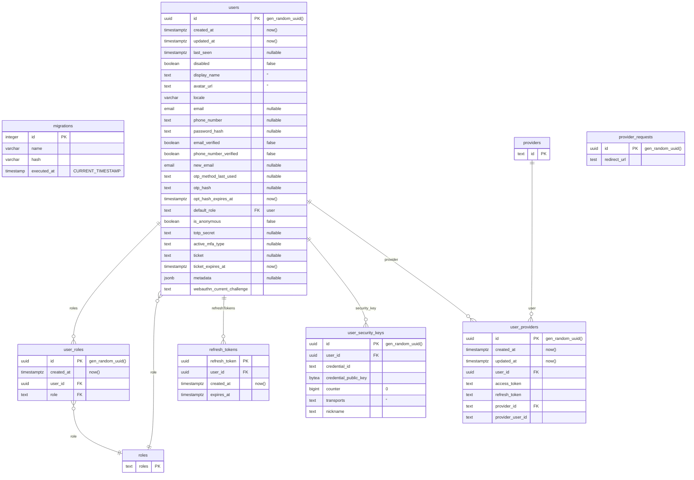

# Database Schema

Hasura Auth stores all its data in a dedicated `auth` PostgreSQL schema. When Hasura Auth starts, it checks if the `auth` schema exists, then automatically syncs the following tables and their corresponding Hasura metadata:

