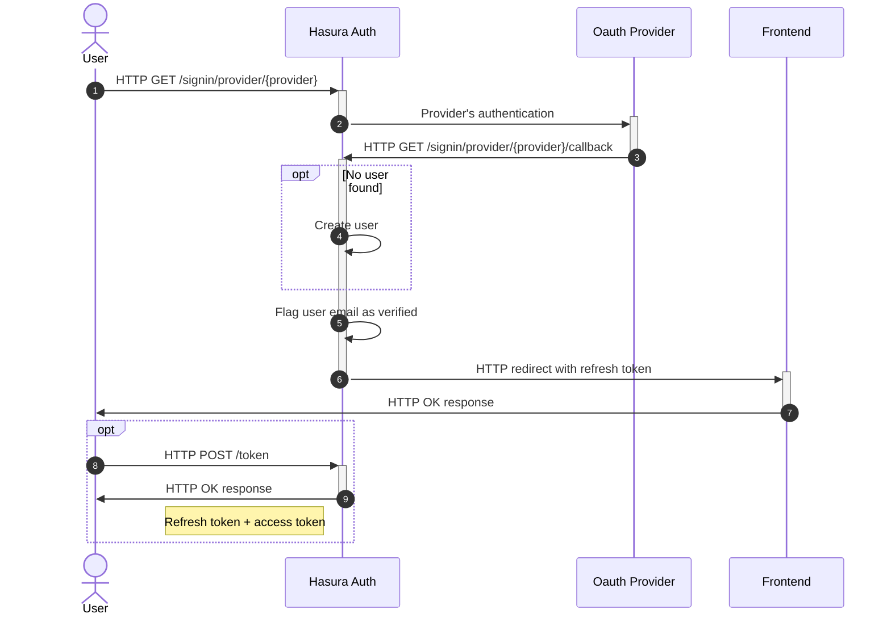

# Oauth social providers

```mermaid
sequenceDiagram
	autonumber
	actor U as User
	participant A as Hasura Auth
	participant P as Oauth Provider
	participant F as Frontend
	U->>+A: HTTP GET /signin/provider/{provider}
	A->>+P: Provider's authentication
	deactivate A
	P->>-A: HTTP GET /signin/provider/{provider}/callback
	activate A
	opt No user found
		A->>A: Create user
	end
	A->>A: Flag user email as verified
	A->>+F: HTTP redirect with refresh token
	deactivate A
	F->>-U: HTTP OK response
	opt
		U->>+A: HTTP POST /token
		A->>-U: HTTP OK response
		Note left of A: Refresh token + access token
	end
```
