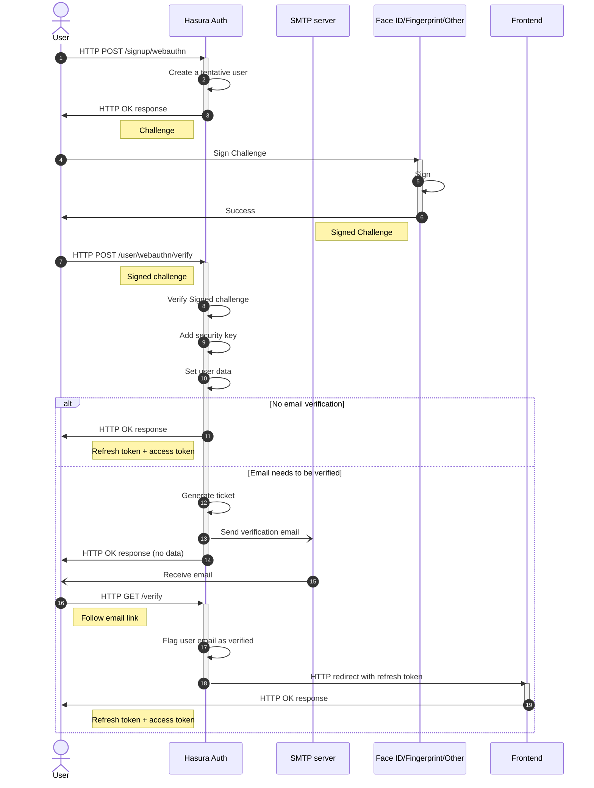
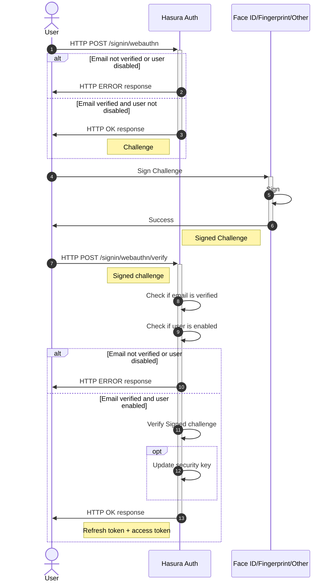
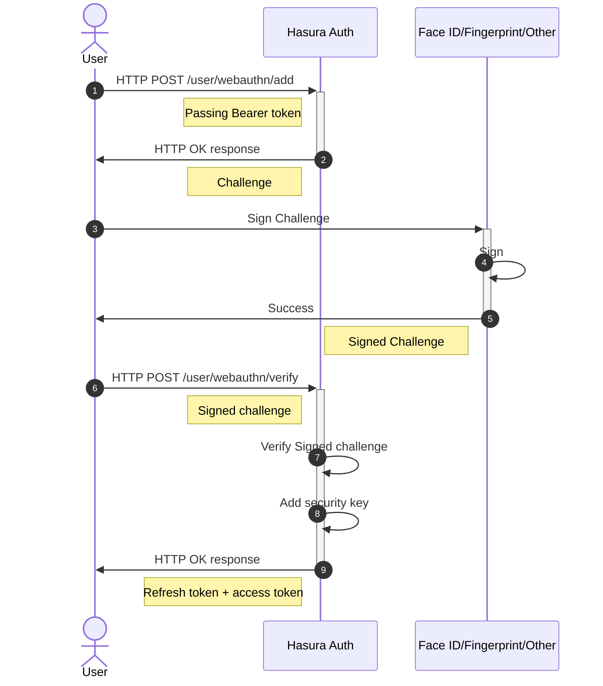

# Security Keys with WebAuthn

Auth implements the WebAuthn protocol to sign in with security keys, also referred as authenticators in the WebAuthn protocol.

A user needs first to sign up with another method, for instance email+password, passwordless email or Oauth, then to add their security key to their account.

Once the security key is added, it is then possible to sign in with it, using the email as a username.

## Sign up

The overall WebAuthn sign up workflow is similar to the email + password sign up workflow: after the user completed the registration of their email and security key, it will return the session, unless the email needs to be verified first. In this latter case, a verification email is sent, and the user is finally able to sign up once the email link is clicked and processed.

## Sign in

## Add a security key

Users can add multiple security keys, for example when they need to login from multiple devices or browsers. Only authenticated users are allowed to add security keys.

