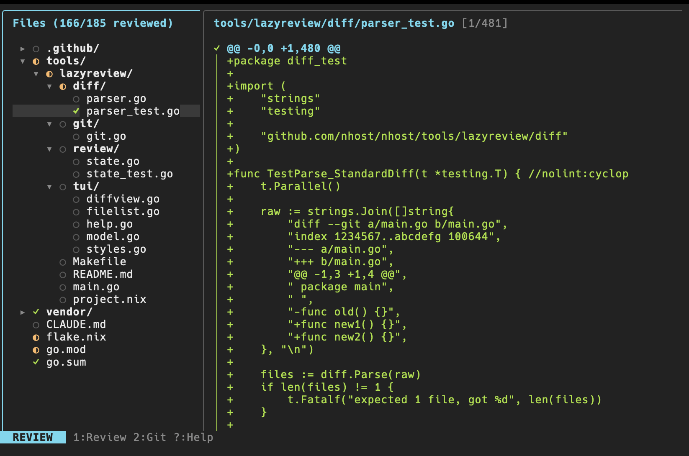
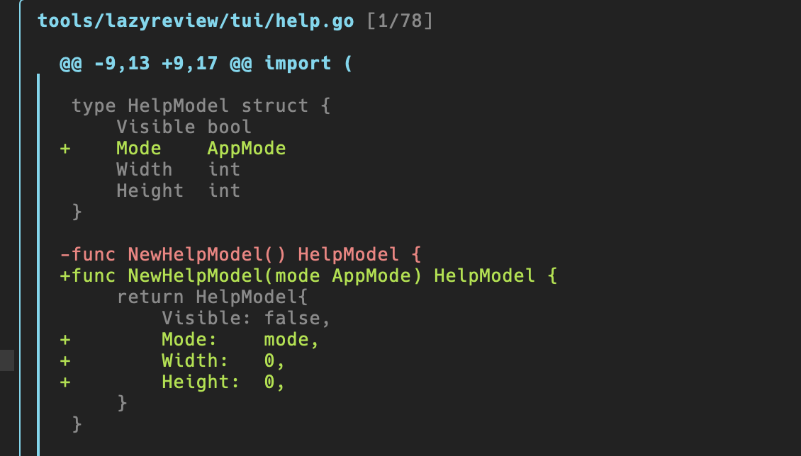

# lazyreview

A TUI tool for reviewing branch diffs file-by-file and hunk-by-hunk. It tracks your review progress across sessions so you can pick up where you left off.

**DISCLAIMER**: This is not an official Nhost product, but rather a tool the team built for our own use and decided to open source in case it's useful to others.

> **Note:** The main purpose of lazyreview is to help you review branches locally by keeping track of which files and hunks you've already reviewed. While it has some basic support for staging and committing changes to git (e.g. you can stage/unstage files and hunks directly from the interface), it's not intended to be a full git client. If you want an awesome terminal git UI, I recommend [lazygit](https://github.com/jesseduffield/lazygit).




## Features

- **Two modes**: Review mode for tracking review progress, Git mode for staging/committing
- Collapsible file tree grouped by directory with partial-review indicators
- Hunk-level and file-level review tracking with auto-advance to next hunk
- Toggle entire directories as reviewed (smart toggle: marks all or unmarks all)
- Persisted review state per branch (stored in `.lazyreview/`), keyed by content hash so changed hunks are automatically re-flagged for review
- Stage/unstage individual files, directories, or hunks in Git mode
- Commit and push directly from the TUI
- Refresh diffs without restarting (`r`)

## Install

```sh
go install github.com/nhost/nhost/tools/lazyreview@latest
```

## Usage

```sh
# From anywhere inside a git repo (diffs against main by default)
lazyreview

# Diff against a different base branch
lazyreview --base develop
```

## Key Bindings

### Navigation

| Key | Action |
|-----|--------|
| `j/k`, `↑/↓` | Navigate tree / navigate hunks |
| `J/K` | Scroll diff up/down |
| `g/G`, `Home/End` | Go to top / bottom |
| `h/←` | Collapse dir / go to parent |
| `l/→`, `Enter` | Expand dir / focus diff |
| `Tab` | Switch panel focus |

### Modes

| Key | Action |
|-----|--------|
| `1` | Switch to Review mode |
| `2` | Switch to Git mode |

### Review mode

| Key | Action |
|-----|--------|
| `Space`, `a` | Toggle reviewed (file/dir/hunk) |

### Git mode

| Key | Action |
|-----|--------|
| `Space`, `a` | Stage/unstage (file/dir/hunk) |
| `c` | Open commit prompt |
| `p` | Push |
| `P` | Force push (`--force-with-lease`) |

### General

| Key | Action |
|-----|--------|
| `r` | Refresh diff |
| `?` | Show help |
| `q`, `ctrl+c` | Quit |

## Review State

Review state is saved automatically on exit and after each refresh to `.lazyreview/<branch>.json`. State is keyed by a hash of each file's diff content — if a file's diff changes between sessions (e.g. you amend a commit), its review state resets so you review the updated hunks.
