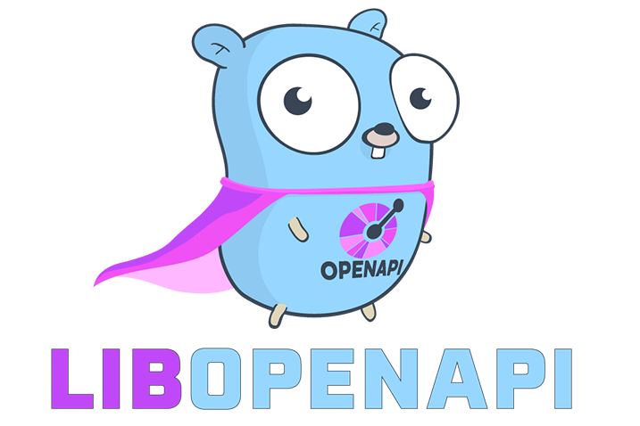

<p align="center">
	
</p>

# libopenapi - enterprise grade OpenAPI tools for golang.


[](https://goreportcard.com/report/github.com/pb33f/libopenapi)
[](https://codecov.io/gh/pb33f/libopenapi)
[](https://discord.gg/x7VACVuEGP)
[](https://pkg.go.dev/github.com/pb33f/libopenapi)

libopenapi has full support for Swagger (OpenAPI 2), OpenAPI 3, and OpenAPI 3.1. It can handle the largest and most
complex specifications you can think of.

---

## Sponsors & users
If your company is using `libopenapi`, please considering [supporting this project](https://github.com/sponsors/daveshanley), 
like our _very kind_ sponsors:

<a href="https://speakeasy.com/editor?utm_source=libopenapi+repo&utm_medium=github+sponsorship">
<picture>
  <source media="(prefers-color-scheme: dark)" srcset=".github/sponsors/speakeasy-github-sponsor-dark.svg">
  
</picture>
</a>

[Speakeasy](https://speakeasy.com/editor?utm_source=libopenapi+repo&utm_medium=github+sponsorship)

<a href="https://bump.sh/?utm_source=quobix&utm_campaign=sponsor">
<picture>
  <source media="(prefers-color-scheme: dark)" srcset=".github/sponsors/bump-sh-dark.png">
  
</picture>
</a>

[bump.sh](https://bump.sh/?utm_source=quobix&utm_campaign=sponsor)

<a href="https://scalar.com">
<picture>
  <source media="(prefers-color-scheme: dark)" srcset=".github/sponsors/scalar-dark.png">
  
</picture>
</a>

[scalar](https://scalar.com)

<a href="https://apideck.com">
<picture>
  <source media="(prefers-color-scheme: dark)" srcset=".github/sponsors/apideck-dark.png">
  
</picture>
</a>

[apideck](https://apideck.com)

---

`libopenapi` is pretty new, so our list of notable projects that depend on `libopenapi` is small (let me know if you'd like to add your project)

- [github.com/daveshanley/vacuum](https://github.com/daveshanley/vacuum) - "The world's fastest and most scalable OpenAPI/Swagger linter/quality tool"
- [github.com/pb33f/openapi-changes](https://github.com/pb33f/openapi-changes) - "The world's **sexiest** OpenAPI breaking changes detector"
- [github.com/pb33f/wiretap](https://github.com/pb33f/wiretap) - "The world's **coolest** OpenAPI compliance analysis tool"
- [github.com/danielgtaylor/restish](https://github.com/danielgtaylor/restish) - "Restish is a CLI for interacting with REST-ish HTTP APIs"
- [github.com/speakeasy-api/speakeasy](https://github.com/speakeasy-api/speakeasy) - "Speakeasy CLI makes validating OpenAPI docs and generating idiomatic SDKs easy!"
- [github.com/apicat/apicat](https://github.com/apicat/apicat) - "AI-powered API development tool"
- [github.com/mattermost/mattermost](https://github.com/mattermost/mattermost) - "Software development lifecycle platform"
- [github.com/gopher-fleece/gleece](https://github.com/gopher-fleece/gleece) - "Building and documenting REST APIs through code-first development"
- Your project here?
---

## Come chat with us

Need help? Have a question? Want to share your work? [Join our discord](https://discord.gg/x7VACVuEGP) and
come say hi!

## Check out the `libopenapi-validator`

Need to validate requests, responses, parameters or schemas? Use the new 
[libopenapi-validator](https://github.com/pb33f/libopenapi-validator) module.

## Documentation

See all the documentation at https://pb33f.io/libopenapi/

- [Installing libopenapi](https://pb33f.io/libopenapi/installing/)
- [Using OpenAPI](https://pb33f.io/libopenapi/openapi/)
- [Using Swagger](https://pb33f.io/libopenapi/swagger/)
- [The Data Model](https://pb33f.io/libopenapi/model/)
- [Validation](https://pb33f.io/libopenapi/validation/)
- [Modifying / Mutating the OpenAPI Model](https://pb33f.io/libopenapi/modifying/)
- [Mocking / Creating Examples](https://pb33f.io/libopenapi/mocks/)
- [Using Vendor Extensions](https://pb33f.io/libopenapi/extensions/)
- [The Index](https://pb33f.io/libopenapi/index/)
- [The Resolver](https://pb33f.io/libopenapi/resolver/)
- [The Rolodex](https://pb33f.io/libopenapi/rolodex/)
- [Circular References](https://pb33f.io/libopenapi/circular-references/)
- [Bundling Specs](https://pb33f.io/libopenapi/bundling/)
- [What Changed / Diff Engine](https://pb33f.io/libopenapi/what-changed/)
- [FAQ](https://pb33f.io/libopenapi/faq/)
- [About libopenapi](https://pb33f.io/libopenapi/about/)
---

### Quick-start tutorial

👀 **Get rolling fast using `libopenapi` with the 
[Parsing OpenAPI files using go](https://quobix.com/articles/parsing-openapi-using-go/)** guide 👀

Or, follow these steps and see something in a few seconds.

#### Step 1: Grab the petstore

```bash
curl https://raw.githubusercontent.com/OAI/OpenAPI-Specification/main/_archive_/schemas/v3.0/pass/petstore.yaml > petstorev3.json
```

#### Step 2: Grab libopenapi

```bash
go get github.com/pb33f/libopenapi
```

#### Step 3: Parse the petstore using libopenapi

Copy and paste this code into a `main.go` file.

```go
package main

import (
	"fmt"
	"os"
	"github.com/pb33f/libopenapi"
)

func main() {
	petstore, _ := os.ReadFile("petstorev3.json")
	document, err := libopenapi.NewDocument(petstore)
	if err != nil {
		panic(fmt.Sprintf("cannot create new document: %e", err))
	}
	docModel, errors := document.BuildV3Model()
	if len(errors) > 0 {
		for i := range errors {
			fmt.Printf("error: %e\n", errors[i])
		}
		panic(fmt.Sprintf("cannot create v3 model from document: %d errors reported", len(errors)))
	}

	// The following fails after the first iteration
	for schemaPairs := docModel.Model.Components.Schemas.First(); schemaPairs != nil; schemaPairs = schemaPairs.Next() {
		schemaName := schemaPairs.Key()
		schema := schemaPairs.Value()
		fmt.Printf("Schema '%s' has %d properties\n", schemaName, schema.Schema().Properties.Len())
	}
}
```

Run it, which should print out:

```bash
Schema 'Pet' has 3 properties
Schema 'Error' has 2 properties
```


> Read the full docs at [https://pb33f.io/libopenapi/](https://pb33f.io/libopenapi/)

---

Logo gopher is modified, originally from [egonelbre](https://github.com/egonelbre/gophers)
